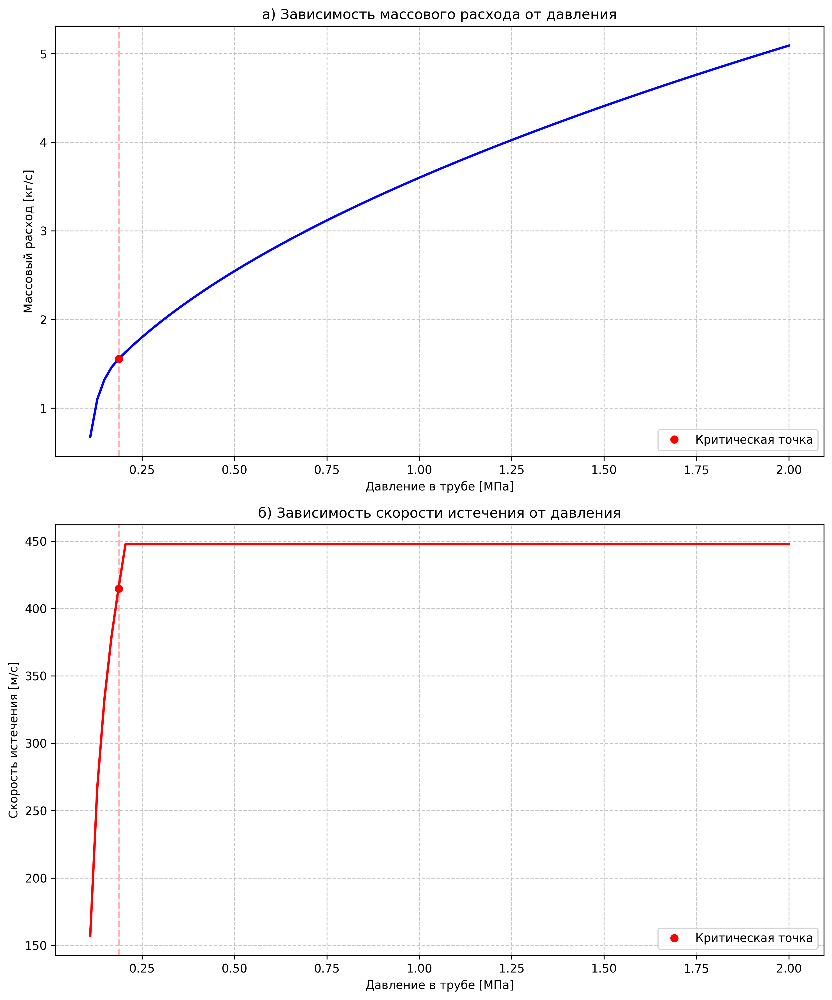
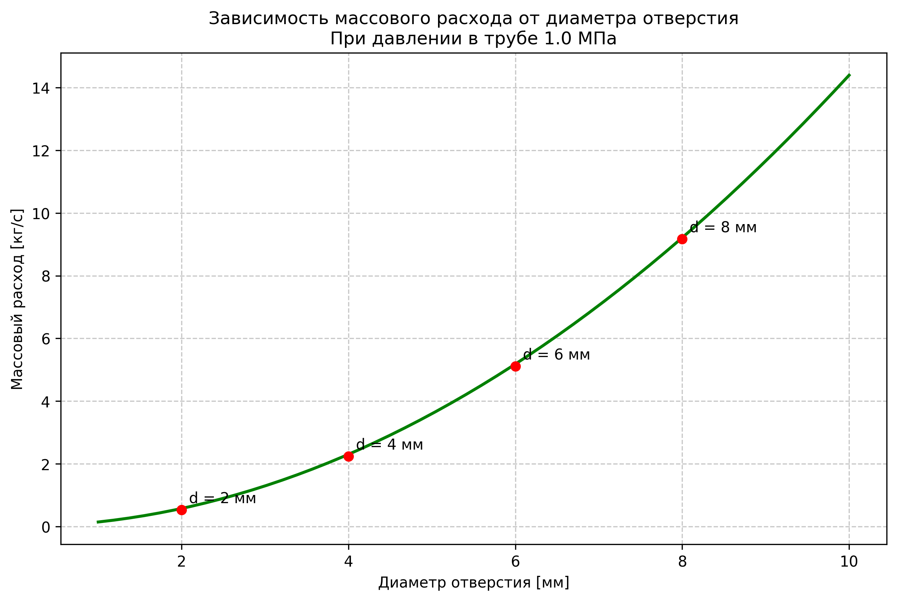

# Математическое описание модели истечения газа через отверстие

*Рис. 1. Характерные зависимости при истечении газа через отверстие диаметром 5 мм:  
а) зависимость массового расхода от давления в трубе;  
б) зависимость скорости истечения от давления в трубе.  
Красной точкой и пунктирной линией отмечен переход между докритическим и критическим режимами.*

*Рис. 2. Зависимость массового расхода от диаметра отверстия при постоянном давлении в трубе 1.0 МПа.  
Красными точками отмечены характерные значения диаметра для демонстрации квадратичной зависимости.*

## 1. Введение

Истечение газа через отверстие является важным газодинамическим процессом, который описывается уравнениями термодинамики и газовой динамики. При истечении газа через отверстие могут реализовываться два режима течения: докритический и критический [1].

## 2. Основные уравнения

### 2.1 Массовый расход

Массовый расход газа через отверстие описывается уравнением Сен-Венана-Ванцеля [2]:

$G = \mu F \sqrt{2k\frac{p_1}{v_1}\frac{1}{k-1}\left[\left(\frac{p_2}{p_1}\right)^{2/k} - \left(\frac{p_2}{p_1}\right)^{(k+1)/k}\right]}$

где:
- $G$ - массовый расход [кг/с]
- $\mu$ - коэффициент расхода
- $F$ - площадь отверстия [м²]
- $k$ - показатель адиабаты
- $p_1$ - давление в трубе [Па]
- $p_2$ - давление окружающей среды [Па]
- $v_1$ - удельный объем газа перед отверстием [м³/кг]

### 2.2 Скорость истечения

Скорость истечения газа определяется уравнением [3]:

$v = \sqrt{2k\frac{RT}{k-1}\left[1 - \left(\frac{p_2}{p_1}\right)^{(k-1)/k}\right]}$

где:
- $v$ - скорость истечения [м/с]
- $R$ - газовая постоянная [Дж/(кг·К)]
- $T$ - температура газа [К]

## 3. Режимы истечения

### 3.1 Критическое отношение давлений

Критическое отношение давлений определяет границу между докритическим и критическим режимами [4]:

$\beta_{cr} = \left(\frac{p_2}{p_1}\right)_{cr} = \left(\frac{2}{k+1}\right)^{k/(k-1)}$

### 3.2 Докритический режим

При $p_2/p_1 > \beta_{cr}$ реализуется докритический режим истечения:
- Скорость истечения меньше скорости звука
- Расход и скорость зависят от отношения давлений
- Скорость увеличивается с ростом перепада давления

### 3.3 Критический режим

При $p_2/p_1 \leq \beta_{cr}$ реализуется критический режим истечения:
- Скорость истечения равна местной скорости звука
- Скорость постоянна и не зависит от дальнейшего увеличения перепада давления
- Расход пропорционален давлению в трубе

Скорость звука в критическом режиме:

$a_{cr} = \sqrt{kRT}$

## 4. Анализ характерных зависимостей

### 4.1 Зависимость от давления

На рис. 1 представлены характерные зависимости параметров истечения от давления в трубе:

1. График массового расхода:
   - В докритической области (малые перепады давления) наблюдается почти линейный рост
   - При переходе в критический режим зависимость становится нелинейной
   - Расход продолжает увеличиваться с ростом давления и в критическом режиме

2. График скорости истечения:
   - В докритической области скорость растет с увеличением перепада давления
   - При достижении критического отношения давлений происходит резкий выход на постоянное значение
   - В критическом режиме скорость равна местной скорости звука и не зависит от дальнейшего увеличения давления

### 4.2 Зависимость от диаметра отверстия

На рис. 2 показана зависимость массового расхода от диаметра отверстия:
- Наблюдается квадратичная зависимость расхода от диаметра
- Это объясняется тем, что расход пропорционален площади отверстия: $G \sim F \sim d^2$
- При увеличении диаметра существенно возрастают потери газа

## 5. Особенности критического режима

В критическом режиме:
1. Скорость истечения достигает максимального значения и остается постоянной
2. Массовый расход продолжает расти с увеличением давления в трубе
3. Параметры потока в критическом сечении не зависят от противодавления

Это явление объясняется тем, что при достижении скорости звука возмущения не могут распространяться вверх по потоку, и дальнейшее снижение противодавления не влияет на параметры в критическом сечении [5].

## Литература

1. Дейч М.Е. Техническая газодинамика. - М.: Энергия, 1974.
2. Абрамович Г.Н. Прикладная газовая динамика. - М.: Наука, 1991.
3. Anderson J.D. Modern Compressible Flow: With Historical Perspective. - McGraw-Hill Education, 2003.
4. Зуев В.С., Лепешинский И.А. Прикладная газовая динамика. - М.: МГТУ им. Н.Э. Баумана, 2016.
5. White F.M. Fluid Mechanics. - McGraw-Hill Education, 2015.

